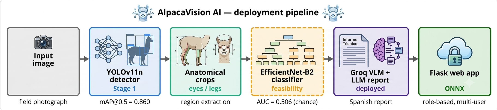
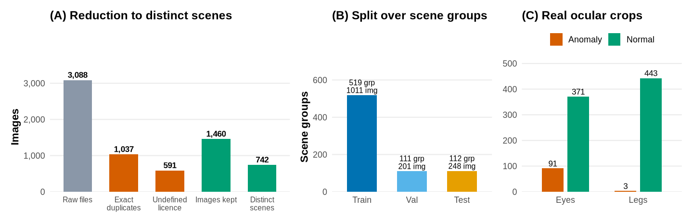
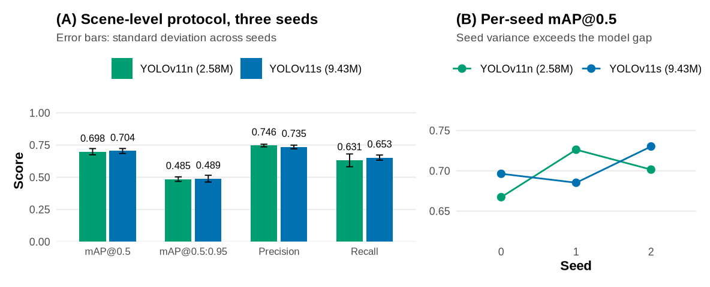
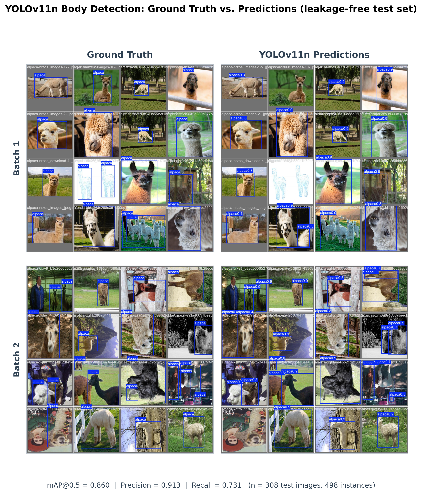
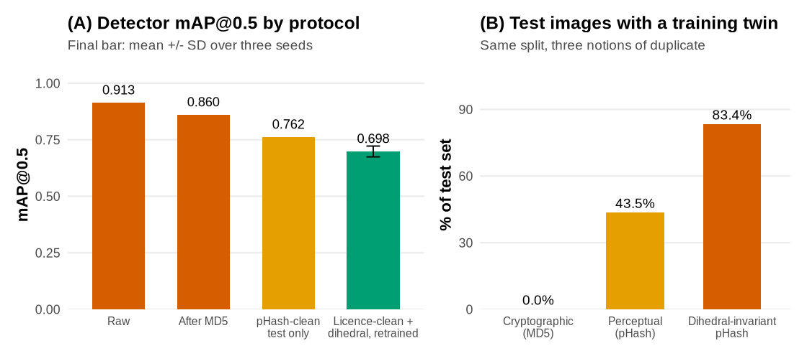
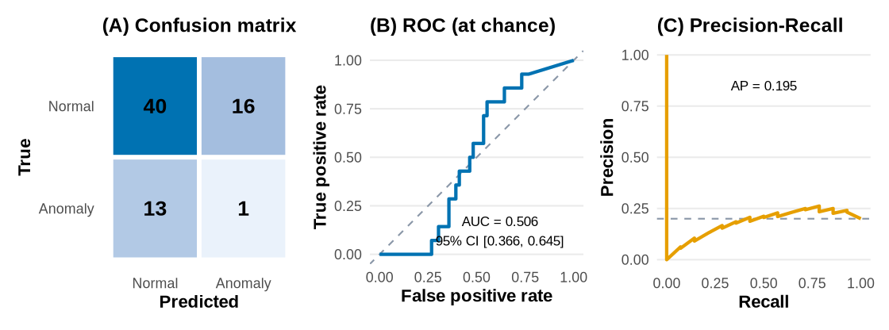
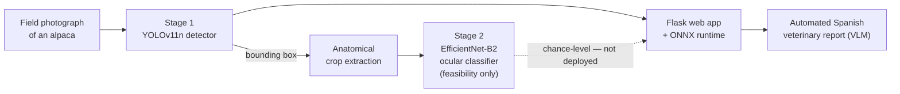
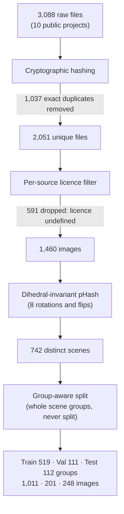
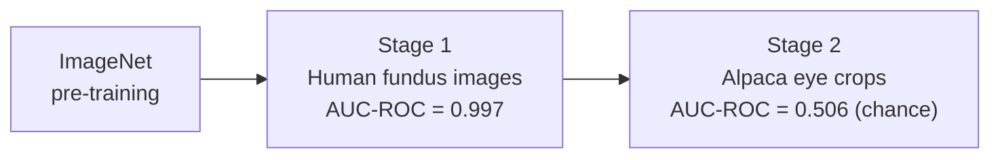

# AlpacaVision — Data Integrity in Vision–Language Auto-Labelling Pipelines

Reproducible code, dataset and methodology for a computer-vision study of alpacas
(*Vicugna pacos*) of the **Peruvian Altiplano**: an openly licensed, deduplicated
**detection benchmark**, a **compact YOLOv11 detector**, an auditable **data-integrity
methodology** for auto-labelling pipelines, and a **controlled negative result** on ocular
anomaly classification.

This repository documents an audit of our own work. Three successive notions of what makes
two images duplicates each certified a data split that the next one invalidated, and the
detector score fell from 0.913 to 0.698 along the way.

[](https://doi.org/10.5281/zenodo.21134001)
[](https://ieeeaccess.ieee.org/)
[](LICENSE)
[](#data)
[](https://www.python.org/)
[](https://pytorch.org/)
[](https://docs.ultralytics.com)
[](https://paqocha.ginit.dev)

**Companion code for the manuscript:** *Data Integrity in Vision–Language Auto-Labelling
Pipelines: An Open Alpaca Detection Dataset, a Compact Detector, and a Reproducible
Methodology* — prepared for *IEEE Access*.

This repository holds the code, the dataset construction methodology and the evaluation
scripts. The manuscript itself is not mirrored here.

<p align="center">
  
</p>

* * *

## Overview

Peru concentrates roughly **87% of the world's alpacas**, yet no public computer-vision
dataset or automated diagnostic tool exists for the species, and morphological-anomaly
screening still relies on subjective inspection by veterinarians who are scarce in remote
high-altitude communities.

Building datasets by **auto-labelling** — generating annotations with open-vocabulary
detectors and vision–language models, then multiplying them with data augmentation — is
fast and increasingly common, but it silently corrupts evaluation in two ways that are
rarely quantified:

1. **Data leakage** — exact duplicates and augmentation copies of the same image cross the
   train/test boundary, so the model is tested on what it memorised during training.
2. **Unreliable machine-generated labels** — vision–language annotations that look
   plausible but carry no consistent, learnable signal for a fine-grained task.

This study measures both failure modes on a concrete real-world pipeline, and releases the
methodology that detects and corrects them.

<p align="center">
  
</p>

<p align="center"><em>
  (A) Reduction funnel: 3,088 raw files → 1,037 exact duplicates removed → 591 dropped for
  an undefined licence → 1,460 images resolving to <strong>742 distinct scenes</strong>.
  (B) Split over scene groups. (C) Real, non-augmented ocular-crop inventory.
</em></p>

**Contributions**

- An **openly licensed, curated detection benchmark** for a previously unaddressed species:
  1,460 images resolving to **742 distinct scenes**, every one under CC BY 4.0.
- A **reproducible data-integrity methodology** — cryptographic deduplication, per-source
  licence filtering, group-aware splitting, label-conflict resolution and a
  **dihedral-invariant** near-duplicate pass — released as code that asserts its own guarantee.
- **Evidence that hash-based deduplication is a moving floor.** Cryptographic deduplication
  left 43.5% of our test set with a training twin; making the perceptual hash invariant to the
  eight dihedral transforms raised that to **83.4%**, because several public projects
  redistribute flipped and rotated copies.
- A **compact YOLOv11n detector** at mAP@0.5 = **0.698 ± 0.024** over three seeds under the
  scene-level protocol, against the 0.913 the same pipeline first reported.
- A **controlled negative case study**: the identical transfer pipeline reaches AUC-ROC =
  0.997 on expert-labelled human-fundus images and 0.506 on auto-labelled alpaca crops.

* * *

## Key results

Detector metrics are on the held-out test set of the **scene-level protocol** (112 scene
groups, 248 images), averaged over **three seeds**.

| Model | mAP@0.5 | mAP@0.5:0.95 | Precision | Recall | Params | Size |
|---|:---:|:---:|:---:|:---:|:---:|:---:|
| **YOLOv11n** (deployed) | **0.698 ± 0.024** | 0.485 ± 0.018 | 0.746 ± 0.010 | 0.631 ± 0.050 | 2.58 M | 5.3 MB |
| YOLOv11s (ablation) | 0.704 ± 0.019 | 0.489 ± 0.026 | 0.735 ± 0.014 | 0.653 ± 0.020 | 9.43 M | 18.3 MB |

<p align="center">
  
</p>

The 3.7× larger YOLOv11s differs by 0.006 mAP@0.5 — about a quarter of the seed-to-seed
standard deviation of either model, so the two are **not distinguishable at this sample
size**. We deploy the compact one. With 742 distinct scenes, the data, not the backbone, is
the binding constraint.

<p align="center">
  
  <br><em>Ground-truth boxes vs. YOLOv11n predictions on held-out test images, under varied
  lighting, occlusion and herd density.</em>
</p>

### On data leakage

Each audit we ran invalidated the guarantee the previous one appeared to provide.

<p align="center">
  
</p>

| Protocol | Train | Test | mAP@0.5 |
|---|:---:|:---:|:---:|
| Raw | 1,435 | 308 | 0.913 |
| After cryptographic deduplication | 1,435 | 308 | 0.860 |
| Perceptually clean test subset (no retraining) | 1,435 | 153 | 0.762 |
| **Scene-level** (licence-clean + dihedral, retrained) | 1,011 | 248 | **0.698 ± 0.024** |

**Share of the test set having a near-duplicate in training**, for the same split, under
three notions of duplicate identity:

| Notion of duplicate | Contaminated test images |
|---|:---:|
| Cryptographic (MD5) | 0.0% — by construction |
| Perceptual (pHash) | 43.5% |
| **Dihedral-invariant pHash** | **83.4%** |

Only about one test image in six was genuinely unseen. The cause is mundane: public projects
re-encode images on export, which defeats cryptographic hashing, and several of them ship
three flipped or rotated copies of every image, which defeats a plain perceptual hash.

> One confound we cannot remove: the scene-level protocol also trains on fewer images
> (1,011 vs 1,435), so its last step mixes removed contamination with reduced training data.
> A matched-size control is future work.

### Ocular classifier — an honest negative result

A two-stage EfficientNet-B2 classifier trained on vision–language auto-labels of ocular
anomalies performs **at chance** (group-aware test, *n* = 70: 14 anomaly / 56 normal).

| Metric | Value | 95% CI |
|---|:---:|:---:|
| AUC-ROC | **0.506** | [0.366, 0.645] |
| F1 (anomaly) | 0.065 | — |
| Accuracy | 0.586 | — |
| Interpretation | Indistinguishable from chance | |

<p align="center">
  
</p>

This is **not** a modelling failure. On the same metric the identical pipeline reaches
**AUC-ROC = 0.997** (95% CI [0.993, 1.000]) on 379 held-out, expertly labelled human-fundus
images, so the collapse occurs only on the auto-labelled alpaca stage.

We re-screened all 462 ocular crops with an independent vision–language model, asking it both
for a label and for whether the crop was assessable at all:

| Quantity | Value |
|---|:---:|
| Declared **not assessable** | **434 / 462 (93.9%)** |
| Rated sharp / limited / poor | 3 / 92 / 367 |
| Assessable by both models | 28 |
| Raw agreement | 60.7% |
| Chance agreement | 56.6% |
| **Cohen's κ** | **0.09** |

The raw 60.7% agreement is almost entirely chance: κ = 0.09 means the two models agree no
better than coin flips. And when a second annotator declares 94% of the crops unassessable,
the statistic is measuring the imagery, not the annotators. The eye crops have a median
smaller side of ≈ 31 px, inherited from low-resolution source images (median ≈ 375 px), so
fine ocular pathology is not plausibly resolvable.

* * *

## How it works

### System pipeline



The deployed system localises the animal with the detector; the ocular classifier is
reported as a **feasibility study and is not used for diagnosis**.

### Stage 1 — YOLOv11n body detector

YOLOv11n is a single-stage, anchor-free convolutional detector: a CSP-style **backbone**
learns hierarchical feature maps, a feature-pyramid **neck** fuses them across scales, and a
**head** predicts bounding boxes and objectness for the single class `alpaca`. It is
deliberately compact (2.58 M parameters, 6.3 GFLOPs, 5.3 MB), trained for 80 epochs (AdamW,
lr₀ = 0.001, batch 8, 640×640, early stopping on validation mAP@0.5) and exported to **ONNX**
for real-time field inference.

### Data-integrity methodology



We hash every file cryptographically, drop sources whose licence does not permit
redistribution, then resolve the survivors into **scene groups** using a perceptual hash
minimised over the eight transforms of the dihedral group — the identity, three rotations,
and each composed with a flip. Whole groups are assigned to a partition, and the build script
**asserts** that no near-duplicate pair crosses a split boundary.

Without the dihedral step the audit finds 747 near-duplicate pairs; with it, 2,788. Three of
the source projects ship three geometrically augmented copies of every image, and a plain
perceptual hash maps those to unrelated codes.

### Stage 2 — EfficientNet-B2 ocular classifier (two-stage transfer learning)



EfficientNet-B2 (MBConv blocks with squeeze-and-excitation, compound-scaled to ~9 M
parameters) is fine-tuned in two stages. Stage 1 adapts the backbone to the eye-disease
domain on real, expertly labelled human-fundus images; Stage 2 fine-tunes on the
auto-labelled alpaca eye crops. The collapse to chance happens only in Stage 2 — the honest
negative result at the heart of the study.

* * *

## Repository structure

```
.
├── config/        dataset_stage1_clean.yaml, train_stage1_clean[_s].yaml
├── scripts/       eval_detector.py, evaluate_classifiers.py, train_two_stage.py,
│                  clean_detector_dataset.py, gen_figures_ggplot.R, figure generators
├── src/           data/ models/ training/ evaluation/ webapp/ (Flask app)
├── outputs/       figures/  (metrics and prediction JSON)
├── docs/          DATASET_CARD.md (dataset provenance, preprocessing and licensing)
├── models/        detector/best_clean*.pt  (git-ignored; see Releases / Zenodo)
├── data/          (git-ignored; deposited to Zenodo) annotated_clean/ = curated dataset
├── requirements.txt
└── LICENSE
```

Trained weights and the image data are not versioned in git: the weights are distributed via
GitHub Releases / Zenodo, and the dataset is deposited on Zenodo (below). All figures are
regenerated from the JSON in `outputs/figures/` by `scripts/gen_figures_ggplot.R`.

* * *

## Data

The curated benchmark (**1,460 images / 742 distinct scenes**, YOLO format) is released
under **CC BY 4.0** and deposited on Zenodo. Every retained source declares CC BY 4.0
explicitly.

| Field | Value |
|---|---|
| DOI | [10.5281/zenodo.21134001](https://doi.org/10.5281/zenodo.21134001) |
| Images | 1,460 (3,088 raw − 1,037 exact duplicates − 591 undefined licence) |
| Distinct scenes | 742 (dihedral-invariant pHash, τ = 6) |
| Format | YOLO (single class `alpaca`) |
| Split | Scene groups 519 / 111 / 112 → images 1,011 / 201 / 248 |
| Sources | Eight public Roboflow Universe projects, all CC BY 4.0 |
| Excluded | One project (591 images) declaring `License: undefined`; iNaturalist imagery was explored but contributes **zero** images |
| License | CC BY 4.0 |

See [`docs/DATASET_CARD.md`](docs/DATASET_CARD.md) for full provenance, preprocessing and
licensing.

* * *

## Installation

Development and training run on **Linux** with an NVIDIA GPU (Python 3.12).

```bash
git clone https://github.com/Andre031222/data-integrity-vision-language-auto-labelling.git
cd data-integrity-vision-language-auto-labelling

python -m venv .venv-linux && source .venv-linux/bin/activate
pip install torch torchvision --index-url https://download.pytorch.org/whl/cu124
pip install -r requirements.txt
```

Secrets (API keys, database URL) go in `.env` (git-ignored); see `.env.example`.

* * *

## Reproducing the study

```bash
source .venv-linux/bin/activate

# Rebuild the benchmark from the raw corpus (licence filter + dihedral dedup)
python scripts/build_dataset_v2.py
# -> 1,460 images, 742 scene groups, asserts 0 cross-split near-duplicate pairs

# Detector — train and evaluate over three seeds under the scene-level protocol
python scripts/train_detector_v2.py --seeds 0 1 2 --tag v2_n
# -> mAP@0.5 = 0.698 +/- 0.024 (YOLOv11n) ; --weights yolo11s.pt -> 0.704 +/- 0.019

# Stage-1 fundus reference metric
python scripts/eval_stage1_fundus.py                       # -> AUC-ROC ~ 0.997

# Classifier — honest, group-aware evaluation
python scripts/evaluate_classifiers.py --task eyes         # -> AUC-ROC ~ 0.506 (chance)

# Regenerate all data figures (R + ggplot2) from the released JSON
Rscript scripts/gen_figures_ggplot.R
```

* * *

## Web application

A Flask dashboard runs the detector with an ONNX runtime and produces an automated
Spanish-language veterinary report. The ocular classifier is shown as a feasibility study
and is **not** used for diagnosis.

```bash
python run_webapp.py            # http://localhost:5000
```

* * *

## Authors

**Universidad Nacional del Altiplano de Puno, Peru** — Professional School of Statistical and
Informatics Engineering, John J. Hopfield Research Seedbed.
Listed in the order of the manuscript.

| Author | Role | ORCID |
|---|---|---|
| Richar Andre Vilca-Solorzano | Author (corresponding) | [0009-0003-2385-5263](https://orcid.org/0009-0003-2385-5263) |
| Dina Maribel Yana-Yucra | Author | [0009-0003-6218-2735](https://orcid.org/0009-0003-6218-2735) |
| Cristian Daniel Ccopa-Acero | Author | [0009-0005-7176-5849](https://orcid.org/0009-0005-7176-5849) |
| Leonid Aleman-Gonzales | Advisor | [0000-0002-4072-6370](https://orcid.org/0000-0002-4072-6370) |

* * *

## Citation

If you use this dataset or code, please cite (details to be updated on acceptance):

```bibtex
@article{vilcasolorzano2026alpacavision,
  title   = {Data Integrity in Vision--Language Auto-Labelling Pipelines: An Open Alpaca
             Detection Dataset, a Compact Detector, and a Reproducible Methodology},
  author  = {Vilca-Solorzano, Richar Andre and Yana-Yucra, Dina Maribel and
             Ccopa-Acero, Cristian Daniel and Alem\'an-Gonzales, Leonid},
  journal = {Informatica},
  year    = {2026},
  note    = {Manuscript under review}
}
```

The dataset has its own citable record:

```bibtex
@dataset{vilcasolorzano2024alpacavision_data,
  title     = {AlpacaVision: A Curated Alpaca Detection Dataset (Peruvian Altiplano), v1.0},
  author    = {Vilca-Solorzano, Richar Andre and Yana-Yucra, Dina Maribel and
               Ccopa-Acero, Cristian Daniel and Alem\'an-Gonzales, Leonid},
  year      = {2024},
  publisher = {Zenodo},
  doi       = {10.5281/zenodo.21134001}
}
```

* * *

## Limitations

- The **detector works and is deployable**; the **ocular classifier does not** — it is at
  chance and is reported as a feasibility study, not a product.
- The scene-level detector trains on fewer images than the original (1,011 vs 1,435), so the
  final step of the drop **mixes removed contamination with reduced training data**. The
  three-seed spread bounds seed variance but not this confound; a matched-size control is
  future work.
- Our near-duplicate criterion is invariant to the **dihedral group only**. Cropping, scaling
  and photometric edits would evade it, so **742 scenes is an upper bound** on the number of
  distinct depictions. Embedding-based retrieval would likely find more.
- The classifier failure is consistent with (i) vision–language auto-labels without veterinary
  validation and (ii) a resolution ceiling (source images ≈ 375 px, eye crops ≈ 31 px), rather
  than with a modelling failure.
- A working ocular classifier will require **expert veterinary ground truth** on
  **purpose-acquired, close-up** imagery (eye region ≳ 128 px) — future work.
- All initially reported metrics (mAP 0.913, AUC 0.824) were inflated and are superseded by
  the numbers above.

* * *

## License

- **Code and documentation:** MIT, see [LICENSE](LICENSE).
- **Dataset:** Creative Commons Attribution 4.0 (CC BY 4.0), via Zenodo.
